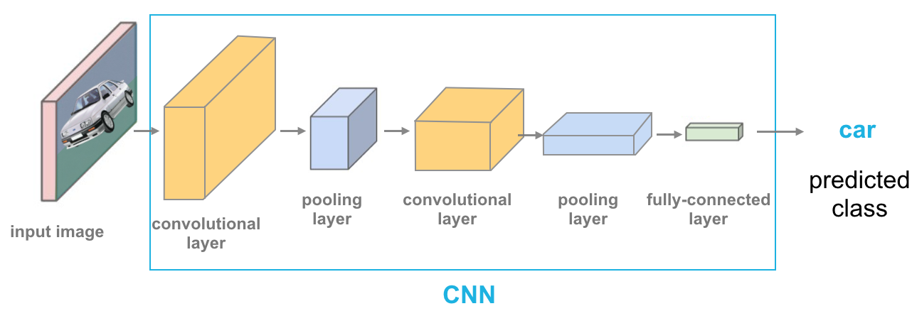

# sprint-3-pb-ufms

Avaliação da terceira sprint do programa de bolsas Compass.uol para formação em chatbot Rasa.

---

# Acesso ao app

(https://jupyter-f-fakeus3r.cloud.okteto.net/)  
(Token de acesso: e7224331a8db2cd21bc553f410d0ce7d5b654a55d4a4bb91)

# Objetivo do projeto:

O objetivo deste projeto é criar uma rede neural capaz de identificar e classificar imagens, a partir de Deep Learning.

## Desenvolvedores

- Leonardo Castiglione Biazom
- Leonardo Mercurio Lino
- Nathan Dezan

# Dataset: Cats vs Dogs :cat::dog:

Disponível em: (https://www.tensorflow.org/datasets/catalog/cats_vs_dogs)    
(Devido a um problema para fazer o _resize_ das imagens, foram utilizadas as contidas neste link: (https://www.kaggle.com/c/dogs-vs-cats-redux-kernels-edition/data))

# Desenvolvimento

## Bibliotecas e Tecnologias utilizadas

### Geral

- Tensorflow/Keras
- TFlearn
- Open Cv2
- Python os
- Numpy
- Random
- Tqdm
- matplotlib

### Para a conexão com MongoDB

- Pymongo
- GridFS

### Tecnologias

- Okteto Cloud (Kubernetes)
- Docker
- Jupyter Notebook

# Preração das imagens e atributos para treino

## Labels

A classificação das imagens se dá por meio de um array com _labels_, onde [1,0] significa que a imagem é completamente gato (sem traços de cachorro), e [0,1] o inverso, dependendo da nomenclatura do arquivo na pasta `/dataset/train/`, a princípio.

## Pré-processamento de imagens

As imagens foram redimensionadas em 50x50px, bem como transformadas para escala de cinza, no intuito de reduzir recursos computacionais.

## Rede Neural - Rede Convolucional (CNN)

A rede neural possui uma sequencia de camadas Convolucionais, de Agrupamento (_Pooling_) e uma camada Totalmente Conectada. Ao todo, são 8 camadas Convolucionais.  

1. O _Input_ recebe os valores de pixel das imagens;
2. A camada Convolucional faz a computação dos pesos, baseados no input;
3. A camada ReLU aplicará a ativação da função;
4. A camada de Agrupamento fará a redução da taxa de amostragem, permitindo capturar atributos estruturais da imagem com maior precisão;
5. A camada Totalmente Conectada computará os _scores_;
6. Por fim será gerado a saída.

A rede foi treinada com um dataset de 25.000 imagens, em 11 épocas.

---

Em suma, a imagem passa por um processo de análise repetidas vezes, cada vez mais profunda, com o objetivo de extrair dados importantes para a análise.  

  

Um vídeo que demonstra isso de uma melhor maneira pode ser visto neste link: (https://www.youtube.com/watch?v=sh-MQboWJug&ab_channel=sentdex)

## Saída

Após ter sido treinada, o modelo possui uma acurácia de 85% (aproximadamente), sendo capaz de identificar, diferenciar e rotular imagens de cachorros e gatos.  

Existe uma conexão ao MongoDB, onde se encontra salvo o modelo do projeto já treinado.  

Exemplo de saída com imagens do set de testes:  
  

# Dificuldades encontradas

## Okteto Cloud - Versão padrão (Helm Chart) do Tensorflow desatualizada

A maior dificuldade encontrada foi em relação a plataforma cloud kubernetes Okteto.
Sua versão pronta do Jupyter Notebook utiliza como base o Python 2 e uma versão extremamente desatualizada do Tensorflow. Isso gerou incompatibilidades com diversas bibliotecas, atrasando o desenvolvimento do projeto.  
Portanto, foi decidido que usar Docker seria a melhor opção, e assim, fomos capazes de utilizar o Python 3, bem como uma versão do Tensorflow mais atualizada, possibilitando o uso das demais bibliotecas, sem erros.

## Dataset: Erro ao redimensionar imagens

Como já mencionado, com o Dataset disponibilizado no site do Tensorflow (Cats vs Dogs), não estávamos conseguindo efetuar o redimensionamento das imagens com o opencv (`cv2.resize`).
Sendo assim, foi necessário encontrar a fonte daquele dataset, hospedado no site Kaggle.

---
